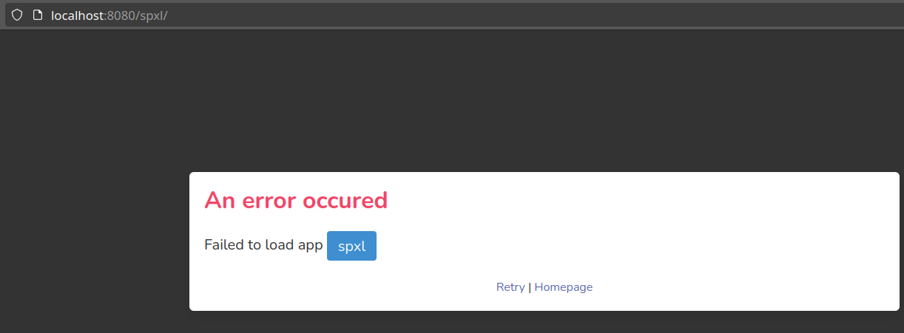

# Troubleshooting

## App not listed in Kiosk

If your app is not listed in the Kiosk, be sure that the app is public: the configuration `app.yaml` file must contain
`public: true`.

Then, save it
```bash
$ sermas-cli app save /apps/myapp
```
 or import it again, if saving the app fails.
```bash
$ sermas-cli app admin import /apps/myapp
```

## Error opening an app



If you see this kind of error when opening an app, you should try saving it
 or importing it again (see commands above).

## MQTT connection errors

If you notice MQTT connection errors in the logs (like `token expired` or similar), please get the container IDs running `docker ps`, then restart the MQTT service, followed by any other disconnecting service using `docker restart [CONTAINER_ID]`.
