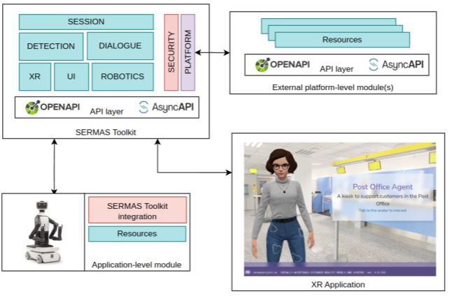

# Architecture

## Agents

The aim of the SERMS Agent is to provide a socially acceptable interaction that satisfies the goals and needs of the user, follows the social context in which the system is being used, and is transparent, safe, secure, explainable and is trusted by the user. To achieve these goals the Agent can take two different forms:

- digital: a virtual avatar that interacts with the user in a natural manner, and is immersed in the surrounding environment;
- physical: a physical robotic agent that moves in the environment and physically interacts with the user and the environment.

Both forms share the same architecture, which is organized into a platform, called hereafter SERMAS Toolkit, hosting and orchestrating different functional modules.

The Toolkit can connect to other external applications through APIs (Application Programming Interfaces) and communication models.

## Modular API-driven architecture

The overall architecture enables fully distributed scenarios, regardless of the location of the involved runtime. 

Runtimes can leverage transparently on remote resources to enable complex services compositions and a mesh of different 
runtimes, eventually enabling multi-user and multi-domain interaction models.

## Security

To tackle security within this architecture, at communication-level the SERMAS Toolkit leverages the JSON Web Token (JWT) based message-signing approach, which contains non-private information of an acting user (or impersonation of a user, such as a module or application runtime). 
Information consistency can be cryptographically verified to avoid JWT data being altered during transport over the network. 

Inspired by Zero Trust Architecture, a centralized component in charge of authentication and authorization identifies and decides which user or 
impersonation may retrieve information or perform action on protected resources the network. Inspired by Zero Trust Architecture, a centralized component in charge of authentication and authorization identifies and decides which user or impersonation may retrieve information or perform action on protected resources.

The SERMAS Toolkit follows an access-control list (ACL) pattern focusing on resource / scopes access control. Access and ACL are performed on JWT tokens obtained providing, for example, a clientId and its password (but other flows are possible, following the OpenID specifications).

At platform level there are two types of users identified by roles: admin and standard users. 
Users can create applications and manage the applications they own. 

Admins have higher privileges that allow them to manage all the resources in the Toolkit (such as applications or modules). 

An application can be managed  with a dedicated client that has full access to all the application specific resources
(those enabled by modules at platform level). Applications can declare their own 
modules that generate clients with ACL level mapping to specific resources and 
scopes constrained to the application context. 

Those clients should have the minimum permissions to deliver their objective and are supposed to be installed 
in the hardware or software implementations of the applications modules (such as 
a kiosk or a robot).

## Modules

As regards the modules, they are defined with the aim of distributing responsibilities for the implementation of the required functionalities and simplifying the implementation of new requirements (identified in later stages of the project or related to other use cases and application scenarios). 

To this end, to identify the required modules for the SERMAS Agent, we considered a bottom-up approach, which started from the requirements and, when possible, merged and abstracted them to identify the corresponding required functionality. As a result, a module will represent a (software and/or hardware) piece of the SERMAS Agent implementing a set of requirements, or a single requirement in some cases.

First, it allows to clearly identify the responsibilities of each module  among project partners, thus identifying teams in charge of addressing each 
requirement. As a result, the risk of leaving some requirements not addressed is reduced. 

Second, it allows scalability towards new application scenarios and use cases, which will follow with the second open call and after the end of the project. 

Indeed, any additional requirements introduced by a new use case can be addressed by the SERMAS Agent by implementing a corresponding module that 
does not conflict or overlap with the existing ones. This is also supported by the presence of an underlying architecture that allows simple integration of new modules and implements a communication protocol shared among the modules.

As a result of this approach, a list of eight modules has been derived that define the functionalities that the SERMAS Agent has to implement to satisfy the requirements of the project use cases:

1. Detection: it provides support to the perception of the world from different 
sensors, including the detection of the interacting user(s);
2. Dialogue: it enables natural language interaction, offering interfaces to 
speech to text, text to speech and large language models (LLMs) to manage 
the interaction between the user and the SEMAS Agent;
3. Robotics: it oversees the control and integration of any robotic component 
of the Agent;
4. Security: it oversees the process of user’s authentication and interaction 
authorization;
5. Session: it tracks the interaction of a user with an instance of the Agent;
6. UI: it enables integrated multimodal interaction features;
7. XR: it tracks immersive experiences interactions;
8. Platform: it offers supporting functionalities to the other modules and provides management APIs to handle application configurations and generic maintenance capability for the overall system.

Additionally, other application-specific modules have been identified, considering requirements related to specific applications in the pilots. For each module, the required features have been analyzed in order to guarantee that system requirements are satisfied. Table 1 provides an overview of the modules and their features. 

It is important to point out that such modules comprise the functionalities required by the SERMAS Agent and do not represent the functionalities that are being implemented in the project. In other words, some of these functionalities are already available on the market or as part of suited development platforms and are simply integrated in the SERMAS architecture, with minor changes and  adaptations; conversely, some other modules functionalities have been developed from the early stage in the SERMAS Toolkit.